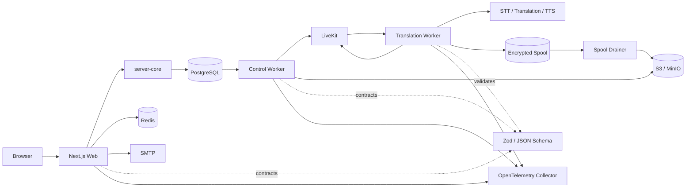

# Transhooter

Transhooter ist eine selbst hostbare Plattform für aufgezeichnete, zweisprachige
Live-Konsultationen zwischen Mitarbeitenden und Kundinnen oder Kunden. Die
Anwendung verbindet LiveKit-Kommunikation mit Streaming-Spracherkennung,
Textübersetzung, Live-Untertiteln, synthetisierter Interpretation und einer
nachprüfbaren Archivierung der Medien- und Provider-Evidenz.

> **Projektstand:** `0.1.0`. Das Repository verwendet einen Clean-Install-Ansatz.
> Die aktuelle Datenbank-Baseline und die aktuellen Datenformate enthalten keine
> Upgradepfade für ältere Installationen. Bestehende Umgebungen müssen aus der
> aktuellen Baseline neu erstellt werden.

## Inhalt

- [Funktionsumfang](#funktionsumfang)
- [Akteure und Berechtigungen](#akteure-und-berechtigungen)
- [Ablauf einer Konsultation](#ablauf-einer-konsultation)
- [Architektur](#architektur)
- [Repository-Struktur](#repository-struktur)
- [Technologie-Stack](#technologie-stack)
- [Voraussetzungen](#voraussetzungen)
- [Installation](#installation)
- [Providerprofile](#providerprofile)
- [Lokaler Betrieb mit Docker Compose](#lokaler-betrieb-mit-docker-compose)
- [Konfiguration](#konfiguration)
- [Secrets](#secrets)
- [Tests und Qualitätsprüfungen](#tests-und-qualitätsprüfungen)
- [Produktionsbetrieb mit Helm](#produktionsbetrieb-mit-helm)
- [Zustände und wichtige Invarianten](#zustände-und-wichtige-invarianten)
- [Archivierung und Wiederanlauf](#archivierung-und-wiederanlauf)
- [Observability](#observability)
- [Fehlersuche](#fehlersuche)
- [Lizenz](#lizenz)

## Funktionsumfang

- Magic-Link-Anmeldung für Mitarbeitende, Administratoren und eingeladene
  Kundinnen oder Kunden.
- Erstellung einer Konsultation mit genau einem `employee`- und einem
  `customer`-Teilnehmer.
- Auswahl eines versionierten Providerprofils und Einfrieren der tatsächlich
  verwendeten Sprachfähigkeiten für jede Konsultation.
- Explizite, snapshotgebundene Zustimmung beider Teilnehmer vor dem Beitritt.
- LiveKit-basierte Audio-/Videokommunikation mit einer getrennten
  Übersetzungsrichtung pro Teilnehmer.
- Streaming-STT, Textübersetzung, Live-Captions und TTS-Interpretation.
- Same-Language-Bypass, wenn Quell- und Zielsprache identisch sind.
- Dauerhafte, wiederanlauffähige Orchestrierung von Räumen, Dispatches,
  Teilnehmerrechten, Egress und Archivabgleich.
- Versionierte S3-Archivobjekte, Checkpoints, Provider-Terminalberichte und ein
  abschließendes vollständiges oder unvollständiges Inventar.
- Administrationsoberflächen für Provider-Sprachen, Fehler und Archive.
- OpenTelemetry-Traces und -Metriken für TypeScript- und Python-Dienste.
- Hermetische End-to-End- und Failure-Recovery-Harnesses.

## Akteure und Berechtigungen

| Rolle | Aufgaben |
| --- | --- |
| `employee` | Konsultationen erstellen, Kunden einladen, eigene Konsultationen öffnen, aktive Konsultationen beenden, noch nicht gestartete Konsultationen stornieren und Archive der eigenen Konsultationen lesen. |
| `customer` | Einladung annehmen, Anzeigename und Sprache setzen, zustimmen und an der zugeordneten Konsultation teilnehmen; kein Archivzugriff. |
| `admin` | Mitarbeiterfunktionen plus Verwaltung der Sprachfähigkeiten und Fehleransicht; alle Archive lesen sowie Holds und Löschungen verwalten. |

Interne Dienste besitzen getrennte Identitäten und eng begrenzte Rechte. Dazu
gehören unter anderem `control-worker`, `translation-worker`, `spool-drainer`
und `language-refresh`. Ein authentifizierter Benutzer, der nicht zur
Konsultation gehört, erhält weder Raumdaten noch ein LiveKit-Token.

## Ablauf einer Konsultation

1. **Erstellen und einladen**  
   Ein Mitarbeitender erstellt eine Konsultation mit Kunde und Providerprofil.
   Die Konsultation beginnt im Zustand `invited`, das Archiv in `pending`. Beim
   Einladungsablauf wird dem Kunden ein Magic Link über SMTP gesendet; das
   Erstellen für eine bestehende `customerUserId` versendet keinen neuen Link.

2. **Präferenzen erfassen**  
   Beide Teilnehmer setzen Anzeigename und Sprache. Sobald beide Sprachen
   bekannt sind, löst die Anwendung das aktive Providerprofil in eine konkrete,
   richtungsbezogene Providerselektion auf und friert sie mit einem Hash ein.

3. **Zustimmen**  
   Beide Teilnehmer stimmen exakt diesem Snapshot zu. Jede spätere Änderung an
   Sprache oder Providerselektion verwirft die vorherige Zustimmung.

4. **Raum bereitstellen**  
   Der erste zulässige Join erhöht die Konsultationsgeneration und schreibt eine
   dauerhafte Provisionierungsanforderung. Der Control-Worker erstellt bzw.
   adoptiert den LiveKit-Raum, startet Egress und dispatcht den
   Translation-Worker.

5. **Capture-Barriere öffnen**  
   LiveKit-Tokens erlauben zunächst Join und Subscribe, aber kein Publish. Erst
   wenn Aufnahme und Worker bereit sind, wird die Veröffentlichung pro
   Teilnehmer freigegeben. Dadurch beginnt die Konsultation nicht ohne
   nachvollziehbare Capture-Bereitschaft.

6. **Bidirektional übersetzen**  
   Für jede Richtung verarbeitet der Python-Worker Audio in der Reihenfolge
   STT → normalisierte Transkriptereignisse → Übersetzung → Caption/TTS. TTS-PCM
   wird nur in vollständigen Frames veröffentlicht. Bei identischen Sprachen
   wird Übersetzung und TTS kontrolliert umgangen.

7. **Beenden und finalisieren**  
   Nur der Mitarbeitende kann eine aktive Konsultation beenden. Danach werden
   Worker und Egress kontrolliert gestoppt, alle bekannten Objekte abgeglichen
   und ein finales Archiv-Inventar erzeugt.

8. **Archiv prüfen oder löschen**  
   Administratoren können alle Archive lesen. Mitarbeitende können nur Archive
   eigener Konsultationen auflisten, öffnen und herunterladen; Kunden haben
   keinen Archivzugriff. Nur Administratoren dürfen Holds verwalten oder
   Archive löschen. Diese Mutationen verlangen eine frische, an die
   Konsultation gebundene Re-Authentifizierung.

## Architektur



### Synchroner Anwendungspfad

`apps/web` stellt UI und API-Routen bereit. Die fachlichen Use-Cases aus
`packages/server-core` werden mit PostgreSQL-, Redis-, SMTP-, S3- und
LiveKit-Adaptern komponiert. Fachzustand, Audit-Einträge und Outbox-Ereignisse
werden transaktional gekoppelt.

### Dauerhafte Orchestrierung

`apps/control-worker` liest Outbox-Ereignisse und Deadlines, plant persistierte
`external_effects` und führt Remote-Effekte mit Lease- und Generations-Fencing
aus. Ein Prozessabsturz zwischen Remote-Aufruf und lokaler Bestätigung führt
nicht automatisch zu einem zweiten Remote-Aufruf: vorhandene Ressourcen werden
anhand der kanonischen Anfrage adoptiert oder bei veralteter Generation
kompensiert.

### Übersetzungspipeline

`services/translation-worker` ist als Ports-and-Adapters-Anwendung aufgebaut:

- `domain`: reine Domänenmodelle ohne ausgehende Schichtabhängigkeiten,
- `application`: Sitzungen, geordnete Stages, Retry und Caption-Assembly,
- `ports`: providerneutrale Schnittstellen,
- `adapters`: Google, Deepgram, DeepL, Fixture, S3 und verschlüsselter Spool,
- `runtime`: LiveKit, interne Control-API, Quotas, Health und Prozess-Lifecycle.

Import-Linter-Verträge verhindern Abhängigkeiten von `domain`, `application`
oder `ports` zurück in Adapter und Runtime.

### Sprachübergreifende Verträge

`packages/contracts` definiert Zod-Schemata für Konsultationen, Provider,
Wire-Pakete, Retry-Entscheidungen, Checkpoints und Archive. Daraus wird
`packages/contracts/generated/contracts.schema.json` erzeugt und an der
Python-Grenze zur Laufzeit validiert.

### Technische Leitentscheidungen

Die folgenden Entscheidungen sind für Änderungen und Betrieb des Systems
maßgeblich. Sie sind keine austauschbaren Implementierungsdetails:

1. **PostgreSQL ist die fachliche Wahrheit.** Fachzustand, Audit, Outbox,
   Deadlines und externe Effekte werden gemeinsam persistiert. Redis,
   LiveKit und S3 sind angebundene Laufzeit- beziehungsweise Ressourcensysteme,
   aus denen der fachliche Zustand nicht rekonstruiert werden muss.
2. **Externe Aufrufe sind persistierte Zustandsmaschinen.** Control-Worker
   claimen Outbox und Effekte mit Owner, Lease und `FOR UPDATE SKIP LOCKED`.
   Kanonische Request-Hashes erlauben nur die Adoption exakt derselben
   Remote-Anfrage. Consultation-Generationen grenzen veraltete Arbeit ab;
   laufende Leases werden während längerer Remote-Aufrufe erneuert.
3. **Providerselektion wird vor dem Join eingefroren.** Die Auswahl verweist
   auf eine konkrete Profilrevision und einen Snapshot-Hash. Ändern sich
   Fähigkeiten oder Gesundheit, wird nicht unsichtbar auf einen anderen
   Provider gewechselt: Auswahl und Zustimmung müssen erneut konvergieren.
4. **Archivvollständigkeit ist ein Beweis, kein Erfolgsflag.** `complete`
   verlangt terminale Room-, Worker- und Egress-Nachweise, die erwarteten
   Objekte und keine ungelösten Gaps oder Fehler. Teilresultate bleiben als
   `incomplete` sichtbar; spätere Supplements sind an den Hash des finalen
   Inventars gebunden.
5. **Die Sprachgrenze ist strikt.** Zod ist die kanonische
   TypeScript-Vertragsquelle; generiertes JSON Schema validiert die
   Python-Grenze. Unbekannte Felder, widersprüchliche Retry-Verknüpfungen oder
   ungültige Identitäten werden abgewiesen statt bestmöglich interpretiert.
6. **Interne Dienste teilen keine Universalidentität.** Compose verwendet
   getrennte Bearer-Secrets und Rechte. Kubernetes verwendet explizit
   zugeordnete ServiceAccounts und kurzlebige, audience-gebundene Tokens;
   automatisches Token-Mounting ist standardmäßig deaktiviert.
7. **Produktionskonfiguration scheitert geschlossen.** Das Helm-Schema erlaubt
   nur unterstützte Providerprofile, verlangt sichere öffentliche URLs und
   KMS-Archivverschlüsselung. Migrationen laufen mit einem separaten
   Datenbankzugang statt mit den eingeschränkten Runtime-Credentials.

Diese Grenzen sind vor allem in
`apps/control-worker/src/orchestration/effect-runner.ts`,
`apps/control-worker/src/adapters/postgres-store.ts`,
`packages/server-core/src/consultations/service.ts`,
`packages/contracts/src`, `apps/web/lib/composition.ts` und
`deploy/helm/transhooter` implementiert.


## Repository-Struktur

```text
.
├── apps/
│   ├── web/                    # Next.js UI, APIs, Auth und Kompositionswurzel
│   └── control-worker/         # Dauerhafte Orchestrierung und Remote-Effekte
├── packages/
│   ├── contracts/              # Zod-Verträge und generiertes JSON Schema
│   ├── server-core/            # Domäne, Use-Cases, Ports und Drizzle-Schema
│   └── telemetry/              # Gemeinsame TypeScript-OTel-Instrumentierung
├── services/
│   └── translation-worker/     # Providerneutraler Python-Worker
├── deploy/
│   ├── compose/                # Basisstack und Provider-/Test-Overlays
│   ├── docker/                 # Reproduzierbare Runtime- und Harness-Images
│   ├── helm/transhooter/       # Kubernetes-Chart
│   └── scripts/                # Migration, Secrets und Bootstrap
├── scripts/                    # Entwicklungs-, Test- und Smoke-Wrapper
└── tests/
    ├── e2e/                    # Browser- und PostgreSQL-Integration
    ├── failure-smoke/          # Recovery- und Fehlerfall-Harness
    └── fixtures/               # Deterministische Provider-Fixtures
```

## Technologie-Stack

| Bereich | Implementierung |
| --- | --- |
| Web | Next.js 16, React 19, TypeScript, Bun |
| Domäne/Persistenz | TypeScript, Drizzle ORM, PostgreSQL 17 |
| Realtime | LiveKit Server, LiveKit Clients und LiveKit Egress |
| Worker | Python 3.13, asyncio, Pydantic, LiveKit Agents |
| Provider | Google Cloud Speech/Translate/TTS oder Deepgram + DeepL |
| Cache/Koordination | Redis 8 |
| Objektspeicher | S3-kompatibler Speicher; lokal MinIO |
| Verträge | Zod und generiertes JSON Schema |
| Telemetrie | OpenTelemetry Collector, OTLP und Prometheus-Export |
| Tests | Bun Test, pytest, Playwright, mypy, Ruff, Biome, Import Linter |
| Deployment | Docker Compose und Helm/Kubernetes |

## Voraussetzungen

### Entwicklung und Tests

- Linux oder eine kompatible POSIX-Umgebung
- Git
- Bun `>=1.3.14`
- Docker Engine mit Compose-v2-Plugin (`docker compose`)
- `uv` für lokale Python-Prüfungen
- Python `>=3.13,<3.14`, wenn der Worker außerhalb des Containers ausgeführt wird
- POSIX-Tools `sh`, `timeout`, `setsid`, `flock`, `mktemp`, `date` und `tr`

### Kubernetes

- Helm 3
- Kubernetes `>=1.34.0-0`
- Externe PostgreSQL-, Redis-, LiveKit- und SMTP-Dienste sowie die APIs des
  gewählten Providerprofils müssen aus dem Cluster erreichbar sein
- Ein vorhandener S3-Bucket mit Versionierung und Object Lock; der Dienst muss
  versionspezifische Operationen, `If-None-Match: *`, CRC64NVME-Prüfsummen,
  Multipart-Uploads sowie in Produktion SSE-KMS mit Bucket Keys unterstützen
- Vorhandene Kubernetes-Secrets und ein persistenter Spool-PVC, den
  Translation-Worker und Spool Drainer gleichzeitig mounten können

Versionen sind in `package.json`, `bun.lock`,
`services/translation-worker/pyproject.toml`, den Dockerfiles und im Helm-Chart
festgelegt. Bei reproduzierbaren Builds die Lockfiles nicht umgehen.

## Installation

```bash
git clone https://github.com/openhoo/transhooter.git
cd transhooter
bun install --frozen-lockfile
cp .env.example .env
```

`.env.example` ist eine Vorlage, keine unmittelbar produktionsfähige
Konfiguration. Vor dem Start müssen mindestens Providerprofil, Admin-E-Mail,
SMTP, öffentliche URLs und die profilspezifischen Werte angepasst werden.
Provider-Credentials gehören als Dateien nach `.secrets/`. Für Compose wird
`SMTP_URL` dagegen ausschließlich als Umgebungsvariable unterstützt: Eine
URL ohne Zugangsdaten kann in `.env` stehen; eine authentifizierte URL nur aus
einer geschützten Prozess- oder CI-Umgebung zuführen und nicht committen.

Ein schneller, isolierter Funktionsnachweis ohne echte Providerzugänge:

```bash
bun run test:hermetic
```

Der hermetische Gate baut einen eigenen Fixture-Stack, führt Verträge,
Typechecks, Architekturprüfungen und Tests aus und entfernt anschließend seine
Container und Volumes sowie die von Compose als lokal eingestuften Images.
Dazu gehört auch das fest benannte lokale MinIO-Image.

## Providerprofile

### `google-eu`

Standardprofil von `./scripts/dev-up`. Erforderlich:

- `.secrets/google-adc.json`
- `GOOGLE_CLOUD_PROJECT`
- `GOOGLE_QUOTA_PROJECT`
- `SMTP_URL`
- `RTC_ADVERTISED_IP`
- `S3_PUBLIC_ENDPOINT`
- `PUBLIC_BASE_URL` als `https://`-URL
- `PUBLIC_LIVEKIT_URL` als `wss://`-URL

Das Overlay verwendet die EU-Endpunkte für Speech und Translation. Die
Credentials-Datei wird read-only nach `/run/secrets/google-adc.json` gemountet.

### `deepgram-deepl-eu`

Erforderlich:

- `.secrets/deepgram-api-key`
- `.secrets/deepl-api-key`
- `DEEPGRAM_STREAMS`
- `DEEPGRAM_AUDIO_SECONDS_MINUTE`
- `DEEPL_REQUESTS_MINUTE`
- `DEEPL_CHARACTERS_MINUTE`
- dieselben SMTP-, RTC-, S3- und öffentlichen TLS-URLs wie beim Google-Profil

Deepgram übernimmt Streaming-STT und TTS; DeepL übernimmt die Textübersetzung.
Die konfigurierten Quoten werden nicht geschätzt und müssen zu den gebuchten
Providerlimits passen.

### `fixture`

Deterministisches Profil für Tests und Smoke-Szenarien. Es verwendet
`deploy/compose/compose.test.yml`, lokale Fixture-Provider und Mailpit. Das
Overlay unterdrückt öffentliche Host-Ports und ist deshalb primär für die
Harnesses gedacht, nicht als interaktiver Browser-Entwicklungsstack.

## Lokaler Betrieb mit Docker Compose

### Stack starten

```bash
# Standard: google-eu
./scripts/dev-up

# Explizites Profil
./scripts/dev-up --provider-profile google-eu
./scripts/dev-up --provider-profile deepgram-deepl-eu
./scripts/dev-up --provider-profile fixture
```

`dev-up`:

1. wählt `deploy/compose/compose.yml` plus genau ein Overlay,
2. prüft die erforderlichen Provider-Secrets und URLs,
3. initialisiert lokale Runtime-Secrets,
4. rendert und validiert die Compose-Konfiguration,
5. speichert Profil und Projektname in `.secrets/compose-state`,
6. baut die aktuellen Quellen und wartet auf semantische Readiness.

Für echte Providerprofile gibt es absichtlich keine unsicheren
Loopback-Defaults für Browser-URLs. `PUBLIC_BASE_URL` muss HTTPS und
`PUBLIC_LIVEKIT_URL` WSS verwenden.

### Logs

```bash
./scripts/dev-logs
./scripts/dev-logs -f web
./scripts/dev-logs --tail=200 control-worker-1
```

### Stoppen und herunterfahren

```bash
# Container nur stoppen
./scripts/dev-stop

# Container entfernen, persistente Volumes behalten
./scripts/dev-down
```

Die Lifecycle-Skripte verwenden den in `.secrets/compose-state` gespeicherten
Stack. Ohne diesen Zustand verweigern sie den Zugriff auf möglicherweise
fremde Compose-Ressourcen.

### Daten löschen

```bash
# Interaktive Bestätigung mit RESET
./scripts/dev-reset

# Nichtinteraktiv
./scripts/dev-reset --yes
```

Der Reset entfernt PostgreSQL-, Redis-, MinIO-, Spool- und Runtime-Config-
Volumes. Dateien unter `.secrets/` bleiben absichtlich erhalten. Ein
`dev-down --volumes` verlangt ebenfalls eine explizite `RESET`-Bestätigung.

### Ports des Provider-Stacks

| Dienst | Standard |
| --- | --- |
| Web | `${WEB_PORT:-3000}:3000` |
| LiveKit API/WebSocket | `7880/tcp` |
| LiveKit RTC/TCP | `7881/tcp` |
| LiveKit RTC/UDP | `${RTC_UDP_PORT_START:-50000}` bis `${RTC_UDP_PORT_END:-60000}` |
| MinIO S3 | `127.0.0.1:9000` |
| MinIO Console | `127.0.0.1:9001` |

PostgreSQL und Redis werden nicht zum Host veröffentlicht. Bei lokalen
Subnetzkollisionen müssen `RTC_SUBNET`, `RTC_ADVERTISED_IP` beziehungsweise
`RTC_BRIDGE_IP` angepasst werden.

## Konfiguration

### Variablen aus `.env.example`

| Variable | Zweck |
| --- | --- |
| `APP_ENV` | Laufzeitumgebung. |
| `PROVIDER_PROFILE` | `google-eu`, `deepgram-deepl-eu` oder `fixture`. Der Wrapper-Parameter ist maßgeblich. |
| `SMTP_URL` | SMTP-Verbindung für Magic Links; in echten Providerprofilen Pflicht. |
| `RTC_ADVERTISED_IP` | Von LiveKit extern annoncierte RTC-Adresse. |
| `S3_PUBLIC_ENDPOINT` | Vom Browser erreichbarer S3-Endpunkt. |
| `PUBLIC_BASE_URL` | Öffentliche Web-URL; echte Providerprofile verlangen HTTPS. |
| `PUBLIC_LIVEKIT_URL` | Öffentliche LiveKit-URL; echte Providerprofile verlangen WSS. |
| `BOOTSTRAP_ADMIN_EMAIL` | E-Mail des initialen Administrators. |
| `BOOTSTRAP_ADMIN_NAME` | Anzeigename des initialen Administrators. |
| `OTEL_SDK_DISABLED` | OpenTelemetry global deaktivieren; `dev-up` aktiviert OTel für den Compose-Stack. |
| `OTEL_EXPORTER_OTLP_ENDPOINT` | OTLP/HTTP-Ziel. |
| `OTEL_TRACE_SAMPLE_RATIO` | Trace-Sampling zwischen `0` und `1`. |
| `GOOGLE_CLOUD_PROJECT` | Google-Cloud-Projekt für Provideraufrufe. |
| `GOOGLE_QUOTA_PROJECT` | Google-Projekt für Quotenabrechnung. |
| `DEEPGRAM_STREAMS` | Maximale parallele Deepgram-Streams. |
| `DEEPGRAM_AUDIO_SECONDS_MINUTE` | Deepgram-Audiobudget pro Minute. |
| `DEEPL_REQUESTS_MINUTE` | DeepL-Requestbudget pro Minute. |
| `DEEPL_CHARACTERS_MINUTE` | DeepL-Zeichenbudget pro Minute. |
| `ARCHIVE_REQUIRE_KMS` | Verlangt KMS-gestützte S3-Verschlüsselung. Lokal standardmäßig `false`, in Helm-Produktion zwingend `true`. |
| `MAGIC_LINK_SEAL_KEYS_FILE` | Pfad zum versionierten Magic-Link-Keyring. |

### Zusätzliche Compose-Tunables

| Variable | Standard | Zweck |
| --- | --- | --- |
| `COMPOSE_PROJECT_NAME` | Nur exportierte Prozessvariable, nicht aus `.env`; Provider: `transhooter`; Fixture: `transhooter-fixture` | Isoliert Container, Netzwerke und Volumes. |
| `APP_IMAGE_TAG` | `local` | Tag der lokal gebauten Anwendungsimages. |
| `WEB_PORT` | `3000` | Host-Port der Webanwendung. |
| `RTC_SUBNET` | Provider: `10.254.231.0/24`; Fixture: `10.254.232.0/24` | Backend-/RTC-Subnetz. |
| `RTC_BRIDGE_IP` | Provider: `10.254.231.10` | Standardadresse für RTC-Ankündigung in Providerprofilen. |
| `RTC_NODE_IP` | Fixture: `10.254.232.250` | Feste LiveKit-RTC-Adresse im Fixture-Netz. |
| `RTC_UDP_PORT_START` | `50000` | Beginn des LiveKit-UDP-Bereichs. |
| `RTC_UDP_PORT_END` | `60000` | Ende des LiveKit-UDP-Bereichs. |
| `OTEL_METRIC_EXPORT_INTERVAL` | `60000` | Metrikexportintervall in Millisekunden. |

## Secrets

Lokale Runtime-Secrets werden durch `deploy/scripts/init-secrets.sh` erzeugt.
Das Skript schreibt atomar, bewahrt vorhandene nichtleere primitive Secrets,
validiert sie und erzeugt daraus abgeleitete URLs und Credential-Bundles neu.
Es setzt restriktive Dateirechte. Zu den getrennten Identitäten gehören:

- PostgreSQL-Rollen für Migration, Web, Control, Translation und Capabilities,
- Redis-Zugang,
- getrennte MinIO-Zugänge für Web, Control, Translation und Spool Drainer,
- LiveKit API-Key und Secret,
- Session-, CSRF- und Egress-Signing-Keys,
- getrennte interne Diensttokens,
- verschlüsselter Spool-Keyring,
- versionierter Magic-Link-Seal-Keyring.

Regeln:

1. Inhalte von `.secrets/` niemals ausgeben oder committen.
2. Provider-Credentials nur in den dokumentierten Dateien ablegen.
3. `.env` nur für nichtgeheime Konfiguration verwenden. Ausnahme: Compose
   unterstützt `SMTP_URL` nicht als File-Secret; authentifizierte SMTP-URLs
   deshalb nur aus einer geschützten Prozess- oder CI-Umgebung zuführen.
4. Bei Keyrotation alte decrypt-only Schlüssel so lange behalten, wie alte
   Daten oder Magic Links noch entschlüsselt werden müssen.
5. Ein Datenreset löscht `.secrets/` absichtlich nicht.

## Tests und Qualitätsprüfungen

### Schnelle lokale Gates

```bash
bun run typecheck
bun run lint
bun run format:check
bun run contracts:check
bun run test
bun run build
```

| Befehl | Abdeckung |
| --- | --- |
| `bun run test:contracts` | Leichte Harness-, Wrapper- und Schema-Verträge. |
| `bun run typecheck` | TypeScript-Projekte und Build-Referenzen. |
| `bun run lint` | Biome-Prüfung des Repositorys. |
| `bun run format:check` | Biome- und Ruff-Formatprüfung. |
| `bun run contracts:check` | Drift zwischen Zod-Quelle und generiertem JSON Schema. |
| `bun run test` | TypeScript- und Python-Unit-/Integrationstests ohne vollständigen Compose-Harness. |
| `bun run build` | Contracts, Server-Core, Telemetrie, Control-Worker und Next.js. |

Nach einer beabsichtigten Vertragsänderung:

```bash
bun run contracts:generate
bun run contracts:check
```

Generierte Verträge nicht manuell bearbeiten.

### Hermetischer Gesamtgate

```bash
bun run test:hermetic
```

Der Wrapper verwendet einen eindeutigen Compose-Projektnamen, ein globales
Harness-Lock, harte Deadlines und ownership-gebundenes Cleanup. Er baut alle
benötigten Images aus dem aktuellen Arbeitsbaum und führt Typechecks,
Schichtverträge, Unit-/Integrationstests sowie Datenbankverträge aus.

Wichtige optionale Deadlines:

- `COMPOSE_HARNESS_LOCK_WAIT_SECONDS` — Standard `300`
- `COMPOSE_BUILD_DEADLINE_SECONDS` — Standard `1800`
- `COMPOSE_START_DEADLINE_SECONDS` — Standard `900`
- `COMPOSE_TEST_DEADLINE_SECONDS` — Standard `1800`
- `COMPOSE_CLEANUP_DEADLINE_SECONDS` — Standard `300`

### Consultation-Smoke

```bash
# Vorhandenen Entwicklerstack verwenden; kein hermetischer Clean-run-Beleg
bun run smoke:consultation

# Eigenen Fixture-Stack erstellen und dessen Container, Netzwerke und Volumes
# aufräumen; gebaute Images bleiben erhalten
./scripts/smoke-consultation --harness-owned
```

Der Smoke führt den vollständigen Mehrbenutzerpfad aus: Magic Links,
Einladung, Präferenzen, Zustimmung, Join, Capture-Barriere, Captions,
Interpretation, Finalisierung sowie unabhängige Prüfung der Archivgrößen,
Hashes, S3-Prüfsummen und des finalen Inventars.

### Failure-Smoke

```bash
bun run failure-smoke

# Einzelnes Szenario an das Harness weiterreichen
./scripts/failure-smoke --scenarios preservation-fence
```

Der Failure-Smoke besitzt immer seinen eigenen Fixture-Stack. Er prüft unter
anderem Crash-Windows, Lease-Fencing, Remote-Adoption, Providerfehler,
Spool-Wiederanlauf, MinIO-Ausfälle, Egress-Abbruch und saubere Finalisierung.
Vor dem Cleanup wird die Compose-Ownership jedes betroffenen Objekts geprüft.

## Produktionsbetrieb mit Helm

Das Chart liegt unter `deploy/helm/transhooter` und installiert nur die
Transhooter-Workloads. PostgreSQL, Redis, S3 und LiveKit müssen erreichbar sein;
der Spool-PVC und alle Secrets müssen bereits existieren.

### Produktions-Values vorbereiten

Die Standardwerte enthalten absichtlich `.example.invalid`, Beispielprojekte
und Beispielimages. Eine eigene Datei, etwa `values.production.yaml`, muss
mindestens Folgendes festlegen:

- reale, unveränderliche Image-Tags; `latest` ist nicht zulässig,
- `config.appEnv: production`,
- `config.providerProfile: google-eu` oder `deepgram-deepl-eu`,
- HTTPS für Web und S3 sowie WSS für LiveKit,
- `config.archiveRequireKms: true` und eine nichtleere `s3KmsKeyId`,
- Runtime-, Migrator-, Provider- und Egress-Config-Secrets,
- vorhandenen Spool-PVC unter `spool.existingClaim`, der von Translation-Worker
  und Spool Drainer gleichzeitig nutzbar ist; typischerweise `ReadWriteMany`
  oder eine ausdrücklich sichergestellte gemeinsame Node-/Storage-Topologie,
- reale Providerprojekte, Endpunkte, Modelle und Quoten,
- passende Ressourcen, Replikate, Ingress und Telemetrie.

Benötigte Secret-Grenzen:

- `existingSecret`: Runtime-Secret mit mindestens `database-url`, `redis-url`,
  `livekit-credentials`, `s3-credentials`, `smtp-url`, `session-secret`,
  `csrf-secret`, `egress-layout-signing-key`, `bootstrap-admin-email` und
  `spool-keyring`; weitere Workload-Keys gemäß den Manifesten,
- `migratorSecret.existingSecret`: ausschließlich Migration-DB-Zugang,
- `magicLinkSealKeys.existingSecret`: versionierter Web-Keyring,
- `providerSecretName`: Provider-Credentials; `providerSecretKeys` muss für
  `google-eu` auf `[google-adc.json]` und für `deepgram-deepl-eu` auf
  `[deepgram-api-key, deepl-api-key]` gesetzt werden,
- `egressConfigSecret`: LiveKit-Egress-Konfiguration.

### Chart prüfen und installieren

```bash
helm lint deploy/helm/transhooter -f values.production.yaml

helm upgrade --install transhooter deploy/helm/transhooter \
  --namespace transhooter \
  --create-namespace \
  -f values.production.yaml \
  --atomic \
  --wait
```

Entfernen:

```bash
helm uninstall transhooter --namespace transhooter
```

Pre-Install-/Pre-Upgrade-Hooks richten begrenztes RBAC ein, migrieren mit einem
separaten Datenbankzugang, publizieren Capabilities, aktualisieren den
Sprachkatalog und führen idempotent `admin:create-staff` für den über
`bootstrap-admin-email` konfigurierten Bootstrap-Administrator aus. Bei
Hookfehlern zuerst Job- und Pod-Logs prüfen; fehlgeschlagene Hooks nicht blind
löschen oder überspringen.

### Kubernetes-Sicherheitsmodell

Die Standardworkloads verwenden:

- `automountServiceAccountToken: false`, außer bei explizit projizierten Tokens,
- non-root UID/GID `10001`,
- read-only Root-Dateisystem,
- `allowPrivilegeEscalation: false`,
- `RuntimeDefault`-Seccomp,
- Drop aller Linux-Capabilities,
- getrennte ServiceAccounts und begrenztes RBAC für Web, Control-Worker,
  Translation-Worker, Spool Drainer und die API-aufrufenden Hook-Helfer.

Migration, Bootstrap-Admin, Egress und der optionale Collector verwenden den
Namespace-Default-ServiceAccount, jedoch ohne automatisch gemountetes Token.

LiveKit Egress besitzt eigene Ressourcen- und Seccomp-Einstellungen. Ein
`Localhost`-Seccomp-Profil darf nur mit vorhandenem Profilnamen aktiviert
werden.

### Trusted Client IP

Trusted Client IP wird nur für einen NGINX-Ingress unterstützt, dessen
Controller `nginx.ingress.kubernetes.io/configuration-snippet`-Annotationen
ausdrücklich erlaubt. Dazu `ingress.enabled: true`, eine nichtleere
`ingress.className`, `ingress.trustedClientIp.enabled: true`,
`controller: nginx`, `configurationSnippetEnabled: true` sowie nichtleere
Namespace- und Pod-Selektoren für exakt die vertrauenswürdigen
Ingress-Controller setzen. Der Header muss mit `x-` beginnen;
`x-forwarded-for` und `x-real-ip` sind verboten. Andernfalls
`config.trustedClientIpHeader` leer lassen.

### Secretrotation

Nach einer Secretrotation die passenden Werte erhöhen:

- `rollout.runtimeSecretRevision`
- `rollout.providerSecretRevision`
- `rollout.egressConfigSecretRevision`

Dadurch werden die betroffenen Pods mit der neuen Projektion neu ausgerollt.

## Zustände und wichtige Invarianten

### Konsultation

```text
invited   → ready
    └─────→ cancelled
ready     → active | finalizing | cancelled
active    → finalizing
finalizing → ended
ended     → deleted
```

Kanonische Zustände: `invited`, `ready`, `active`, `finalizing`, `ended`,
`cancelled`, `deleted`.

### Archiv

```text
pending → recording
pending | recording → reconciling → complete | incomplete
complete | incomplete → deleting → deleted
deleting → incomplete   # fehlgeschlagene Löschung
```

### Externe Effekte

```text
planned      → calling
calling      → calling | applied | done | failed | compensating
applied      → done | compensating
compensating → done
```

Wichtige Invarianten:

- Genau zwei unterschiedliche Teilnehmer: ein `employee`, ein `customer`.
- Join erfordert vollständige Präferenzen, eingefrorene Providerselektion und
  die Zustimmung beider Teilnehmer zum identischen Snapshot.
- Sample-Ranges sind inklusive/exklusive Intervalle mit `end > start`.
- Checkpoint-Wasserstände werden pro Richtung monoton fortgeschrieben; erkannte
  Recovery-Lücken werden explizit im Feld `gaps` dokumentiert.
- Generations-Fencing wird vor Remote-Aufrufen sowie für Effekte in `calling`,
  `applied` und `compensating` durchgesetzt. Veraltete `planned`-Effekte werden
  derzeit nicht in `compensating` überführt.
- Remote-Adoption ist nur bei identischer kanonischer Anfrage zulässig.
- Archivschlüssel folgen `v1/meetings/<consultation-uuid>/...`.
- Ein `complete`-Inventar verlangt erfüllte und verifizierbare Erwartungen,
  terminale Room-, Worker-Checkpoint- und Egress-Nachweise mit
  Egress-Objekten sowie keine ungelösten Provider-Gaps.

## Archivierung und Wiederanlauf

Das Archiv kann unter anderem folgende Objektklassen enthalten:

- Pipeline-Exchanges und Provider-Terminalberichte,
- STT-Eingangs-, TTS-Ausgangs- und LiveKit-Ausgangs-PCM,
- PCM-Sidecars mit Encoding, Rate, Kanälen und Sample-Range,
- Caption-Ledger und WebVTT,
- Composite-, Teilnehmer- und Track-Medien,
- Egress-Manifeste,
- Worker-Checkpoints,
- finales Inventar und spätere Supplements.

### Warum es den Spool gibt

Der **Spool** ist kein gewöhnlicher Message-Queue-Puffer, sondern ein lokales,
verschlüsseltes **Write-before-effect-Journal**. Er schützt bereits akzeptierte
Audio-, Provider- und Checkpoint-Evidenz in dem Zeitfenster, in dem S3, der
Control-Worker oder der Worker-Prozess ausfallen können.

Die zentrale Reihenfolge lautet:

```text
lokal verschlüsselt und dauerhaft schreiben
    → idempotent nach S3 hochladen
    → beim Control-Worker registrieren
    → lokal als uploaded quittieren
    → nur geeignete lokale Payloads kompaktieren
```

Beispielsweise wird eingehendes LiveKit-Audio zuerst als `stt-input` gespult
und erst danach an den STT-Provider übergeben. Kann der Spool die Evidenz nicht
sicher erhalten, stoppt der Worker diesen Pfad bewusst, anstatt ungesicherte
Providerarbeit fortzusetzen.

### Persistenz und Verschlüsselung

Jeder Spool-Eintrag besteht aus einem verschlüsselten `.wal`-Envelope und einem
SQLite-Indexeintrag. Der Envelope bindet unter anderem Objekt-, Consultation-
und Attempt-ID, Stage, Richtung, Medientyp, Sample-Range, Schlüssel-ID sowie
Klartext- und Ciphertext-Hash kryptografisch an den Payload.

- Der Payload wird mit AES-256-GCM und einer zufälligen 12-Byte-Nonce
  verschlüsselt; der kanonische Header ist Additional Authenticated Data.
- Der Keyring kann mehrere Schlüssel enthalten. Neue Einträge verwenden den
  aktiven Schlüssel; alte Einträge bleiben lesbar, solange ihr Schlüssel
  vorhanden ist.
- SQLite verwendet WAL-Modus, `synchronous=FULL` und Foreign Keys.
- Prozess- und Dateisperren serialisieren Zugriffe von Translation-Worker und
  Spool Drainer auf dem gemeinsam gemounteten Spool.

Der Dateicommit ist absichtlich **Datei vor Index**:

```text
temporäre Datei vollständig schreiben und fsyncen
    → atomar nach <object-id>.wal umbenennen
    → Spool-Verzeichnis fsyncen
    → SQLite-Datensatz als committed anlegen
```

Nach einem Absturz kann daher eine authentifizierte finale Datei ohne
Indexeintrag übrig bleiben, aber kein gültiger Index auf eine noch nicht
veröffentlichte Datei entstehen. Beim Start entfernt die Recovery alte
Tempdateien, validiert und importiert authentifizierte verwaiste Envelopes und
prüft, dass alle nicht kompaktierten indexierten Payload-Dateien vorhanden
sind. Ungültige verwaiste Envelopes werden quarantänisiert. Die Integrität
indexierter Payloads wird beim Lesen authentifiziert; fehlende Dateien oder
eine dabei erkannte ungültige Integrität führen zu `SpoolUnavailable`.

### Idempotenz, Backpressure und Quarantäne

Eine deterministische `object_id` darf wiederverwendet werden, wenn Identität,
Metadaten, Sample-Range, Hashes, Header und entschlüsselter Payload exakt
übereinstimmen. Eine abweichende Wiederverwendung wird fail-closed abgewiesen.
Damit können Wiederholungen nach Crash oder Netzfehler dieselbe Evidenz
fortsetzen, ohne widersprüchliche Duplikate zu erzeugen.

Vor jedem Append projiziert der Spool die Belegung inklusive Payload und
1 MiB Sicherheitsreserve. Ab 80 Prozent wird der Write mit
`SpoolUnavailable` abgelehnt. Diese frühe Backpressure nimmt lieber keine neue
Arbeit an, als das Journal während einer kritischen Persistierung volllaufen zu
lassen.

Der Spool Drainer verarbeitet `committed`-Objekte mit deterministischen
Create-once-S3-Schlüsseln. Erst nach erfolgreichem Upload **und** erfolgreicher
Registrierung beim Control-Worker wird ein Objekt `uploaded`. Temporäre
Registrierungsfehler lassen es für einen späteren Versuch `committed`;
permanent abgelehnte Objekte werden isoliert `quarantined` und nicht
stillschweigend verworfen.

```text
committed → uploaded → lokal kompaktierbar
    ├─────→ committed     # temporärer Fehler, später erneut versuchen
    └─────→ quarantined   # permanente, objektspezifische Ablehnung
```

Nur explizit replay-unabhängige, bereits hochgeladene Envelopes sind für die
lokale Kompaktierung geeignet. Checkpoints, Terminalevidenz und PCM besitzen
strengere Aufbewahrungs- beziehungsweise Kompaktierungsregeln.

### Checkpoints und Recovery-Wasserstände

Checkpoints verketten akzeptierte Eingabe-, Provider-Ausgabe- und
veröffentlichte Ausgabewasserstände kryptografisch. Wasserstände müssen pro
Richtung monoton sein; jeder Checkpoint referenziert den Hash seines
Vorgängers. Die Checkpoint-Evidenz und ihre Delivery-Zeile werden vor der
Übermittlung an den Control-Worker gemeinsam im Spool registriert und können
bis zur Bestätigung erneut zugestellt werden.

Dadurch kann derselbe Worker-Epoch nach einem Prozessabsturz seine bestätigten
beziehungsweise noch ausstehenden Checkpoints wiederherstellen und erkennen,
welche Samples sicher akzeptiert oder emittiert wurden. Ein neuer Worker-Epoch
beginnt eine eigene Checkpoint-Kette. Die Felder für erwartete und beobachtete
Objekt-IDs in Checkpoints sind derzeit leer; Inventar und PCM-Abgleich
verwenden deshalb die übrigen Identitäts-, Sample- und Hashbelege.

### Zusammenspiel mit der Control-Orchestrierung

Der Spool schützt den Workerpfad; die persistierten externen Effekte schützen
den Control-Pfad. Die Orchestrierung unterscheidet zwischen geplantem,
aufgerufenem, remote angewandtem und lokal abgeschlossenem Effekt. Ein
`applied`-Effekt bleibt claimbar, sodass ein anderer Control-Worker die bereits
persistierte Remote-Antwort nach einem Absturz fortsetzen kann, ohne den
Remote-Aufruf erneut auszuführen.

Effektclaims besitzen Owner und Ablaufzeit. Generations-Fencing wird vor
Remote-Arbeit, bei der lokalen Anwendung und bei Kompensation geprüft;
abgelaufene Leases und veraltete Generationen dürfen keinen neueren Besitzer
überschreiben.

Compose verwendet für den Drainer eine eigene, begrenzte S3-Identität. Im
Helm-Chart mounten Translation-Worker und Spool Drainer denselben persistenten
Spool-PVC; beide verwenden derzeit den Runtime-Key `s3-credentials`.

## Observability

TypeScript- und Python-Dienste exportieren OpenTelemetry-Daten über OTLP/HTTP.
Der Compose-Stack enthält einen Collector; `dev-up` aktiviert die SDKs für den
Stack. Der Helm-Collector ist standardmäßig deaktiviert.

Helm-Konfiguration:

- `telemetry.enabled`
- `telemetry.endpoint`
- `telemetry.traceSampleRatio`
- `telemetry.metricExportIntervalMillis`
- `telemetry.collector.enabled`

Der integrierte Collector bietet standardmäßig OTLP/gRPC `4317`, OTLP/HTTP
`4318`, Prometheus `8889` und Health `13133`. Bei Prozessbeendigung verwenden
die Dienste einen begrenzten Flush, damit gerade erfasste Telemetrie nicht
unnötig verloren geht.

## Fehlersuche

### `No recorded transhooter stack`

`dev-stop`, `dev-down`, `dev-reset` und `dev-logs` benötigen
`.secrets/compose-state`. Zuerst den Stack über `./scripts/dev-up` starten. Die
State-Datei nicht manuell auf ein fremdes Compose-Projekt umbiegen.

### Produktionsprofil lehnt URLs ab

`google-eu` und `deepgram-deepl-eu` verlangen:

- `PUBLIC_BASE_URL=https://...`
- `PUBLIC_LIVEKIT_URL=wss://...`

Die Prüfung erfolgt über die tatsächlich von Compose geladene Umgebung,
einschließlich der Repository-Datei `.env`.

### Provider-Preflight schlägt fehl

- Existenz und Nichtleerheit der erwarteten Datei unter `.secrets/` prüfen.
- Google-Projekt und Quotenprojekt prüfen.
- Deepgram-/DeepL-Quotenwerte als positive, zum Account passende Limits setzen.
- Endpunkt-Erreichbarkeit aus dem Container-Netz prüfen.
- Geheimnisse nicht in Logs kopieren.

### LiveKit ist aus dem Browser nicht erreichbar

- `PUBLIC_LIVEKIT_URL` muss aus dem Browser erreichbar sein.
- `RTC_ADVERTISED_IP` muss auf den Host bzw. Load Balancer zeigen.
- TCP `7880/7881` und der konfigurierte UDP-Bereich müssen freigegeben sein.
- Docker-Subnetzkollisionen mit `RTC_SUBNET` vermeiden.

### Der hermetische Test wartet auf das Harness-Lock

Die Test-, E2E- und Failure-Harnesses serialisieren Compose-Zugriffe über ein
Lock. Keine Lockdatei löschen, während ein Harness läuft. Bei langen Builds die
dokumentierten Deadline-Variablen gezielt erhöhen.

### Migration oder Helm-Hook schlägt fehl

- Logs des konkreten Jobs lesen.
- Erreichbarkeit und Berechtigungen des separaten Migrator-Zugangs prüfen.
- Nicht versuchen, historische Migrationen einzuspielen: dieses Repository
  enthält genau eine Clean-Install-Baseline.
- Einen fehlgeschlagenen Hook nicht als erfolgreichen Rollout behandeln.

## Lizenz

Transhooter steht unter der [Apache License 2.0](LICENSE).
